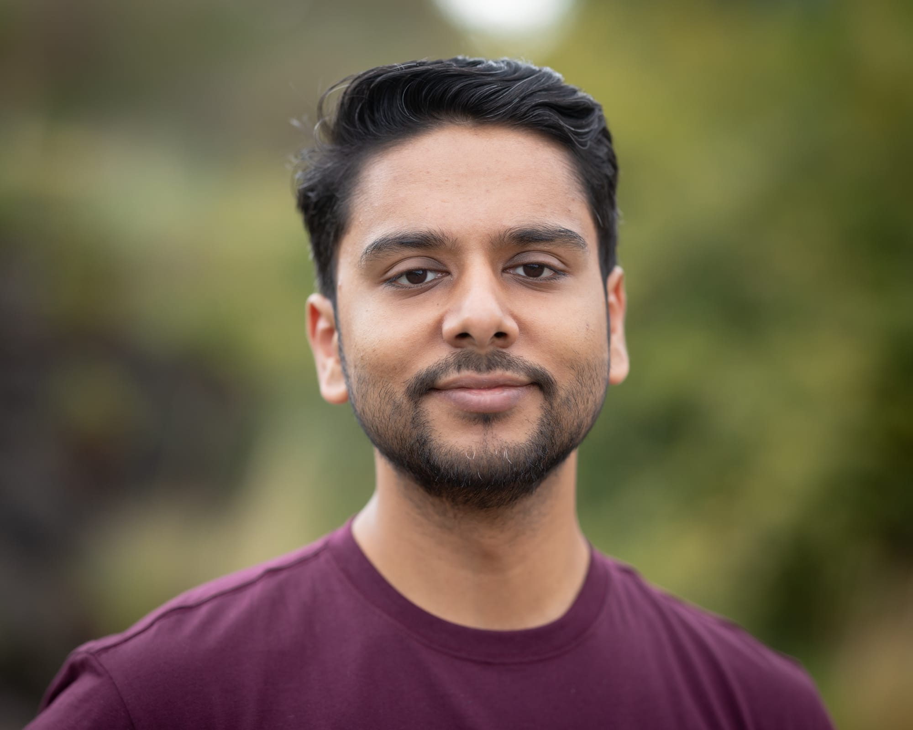

Hi, I'm Vatsal 👋

I make games, apps, libraries, art and more with the Unity engine.

* I work at [ManageXR](https://www.managexr.com) where I develop our Unity VR application and SDKs
* See my professional and education background on [LinkedIn](https://www.linkedin.com/in/vatsalambastha/?ref=vatsalambastha.com)
* My open source work is on [Github](https://www.github.com/adrenak?ref=vatsalambastha.com)
* I also have a not-so-active [Youtube channel](https://www.youtube.com/@VatsalAmbastha) where I sometimes upload dev logs and UniVoice tutorials.
* To see some visuals of what I make, check out my [Behance profile](https://www.behance.net/adrenak)
* I publish short games on [adrenak.itch.io](https://adrenak.itch.io/?ref=vatsalambastha.com)
* Sometimes I sketch and post them on Instagram [@brbsketching](https://www.instagram.com/brbsketching?ref=vatsalambastha.com)

Email me at ambastha.vatsal@gmail.com

Or, message me on Discord. My username is `adrenak`

Or, join my Discord server